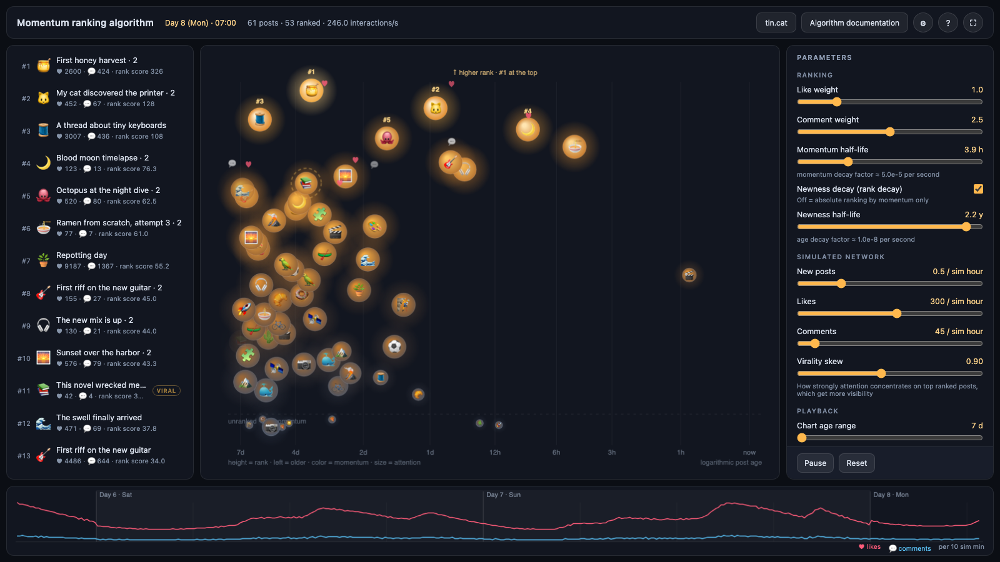
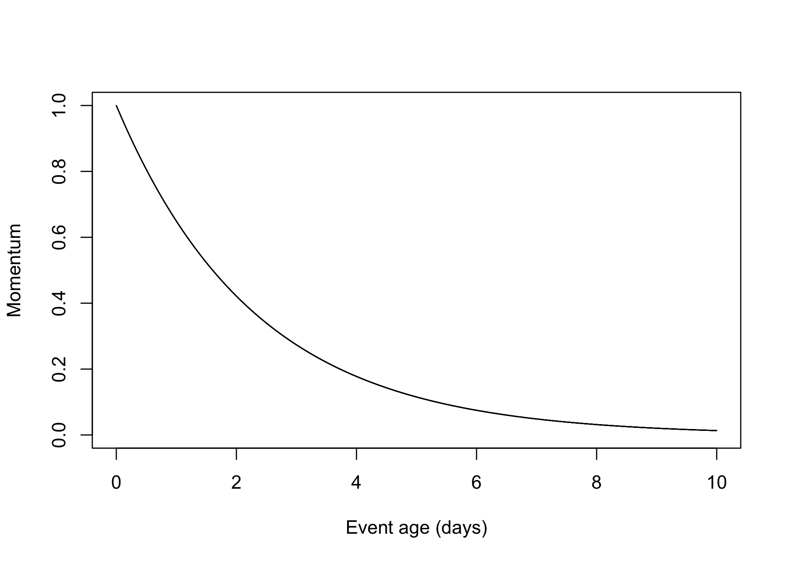
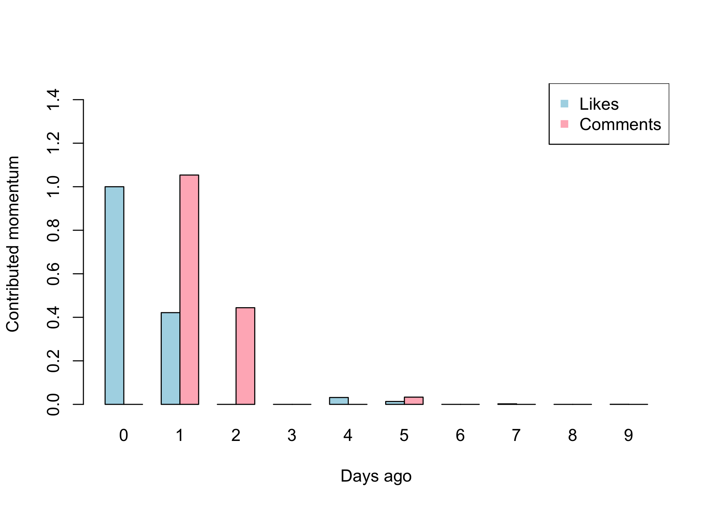

# Momentum ranking algorithm

A performance oriented algorithm to rank items based on their momentary parametric relevance, suitable for social network feeds, real-time curated timelines, e-commerce relevance listings and other momentum-based data analysis.

It attains high performance even in databases with a very big number of items, and is optimized to keep ranks relevantly up to date, presenting relevance-ranked item lists that react close to real time.

## Live demo

Watch the algorithm rank a simulated social feed in real time: posts enter the system, receive likes and comments from simulated users, heat up, climb the ranking and cool down as attention fades. Old posts visibly come back to the top when a burst of new likes hits them, and network activity follows day and night cycles with quieter weekends.

Every parameter of the algorithm can be tweaked live: event weights, decay factors, the newness factor and the behavior of the simulated network. You can also click any post to make it go viral and watch it climb the ranking.

To run it locally, open `demo/index.html` in a browser. It has no dependencies and needs no build step.

## Key ideas

- Items are ranked by their current momentum, a compound measure of the significant events they receive: likes, comments, views, purchases or any other indicator.
- Momentum can grow at any point in time. Old items become relevant again if they receive enough recent attention, unlike simple decaying algorithms where indicators only wear out with age.
- Each event type has its own weight, so some interactions can matter more than others.
- An adjustable newness factor favors recent items, to build timelines of the latest relevant items. Deactivating it yields an absolute ranking based purely on current momentum.
- No warmup factor is needed: only items that have already received attention are ranked.

## How it works

Every event contributes momentum to an item. The contribution of a single event with weight $l_w$ and momentum decay factor $l_f$ fades exponentially as the event's age $l_t$ grows:

$$m_{ln} = l_w * (1 - l_f)^{l_t}$$

*A single event's contribution decays with age: recent attention counts heavily, old attention is gradually forgotten.*

An item's instant momentum is the sum of the contributions of all its events across all indicators, each indicator with its own weight and decay parameters. In this example an item received likes and comments over several days, with comments weighing more than likes:

*Recent likes and comments dominate the item's instant momentum, while older events contribute almost nothing.*

To favor recent items in the final ranking, an additional age decay factor $t_f$ is applied to the instant momentum $m$ of an item of age $t_c$:

$$r = m * (1 - t_f)^{t_c}$$

## Built for performance

Recalculating momentum for every item on every query does not scale. The [presentation](doc/momentum_ranking_algorithm.md) includes a precalculation strategy that:

- Stores precalculated ranks in an indexed table, so ranked lists are obtained with fast, index-friendly queries.
- Supports multiple rank settings, so different sections of an application can use different decay tunings.
- Refreshes ranks adaptively: items that received events recently are recalculated often, while dormant items are revisited progressively less often, keeping compute bounded as the database grows.

## Author

Lorenzo Herrera
[tin.cat](https://tin.cat)
[loren@tin.cat](mailto:loren@tin.cat)

## License

Released under the [MIT License](LICENSE)
