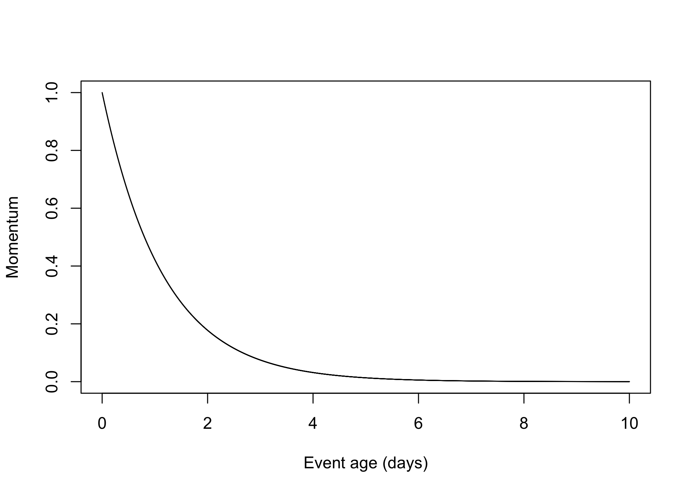
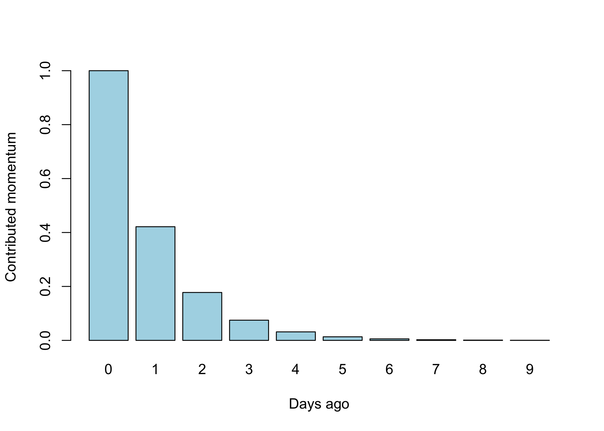

A performance oriented algorithm to rank items in a set based on their momentary relevance.

-   Items are ranked based on their current momentum.
-   Momentum is a composite measure based on significant events triggered for a given item.
-   Momentum can grow at any point in time, even for old items.
-   By adjusting a _newness_ factor, the algorithm will favor recent items to be ranked higher, so a rank of the latest relevant items can be created.
-   Completely deactivating the _newness_ factor will provide an overall ranking of all items, taking only into account their current momentum.

# Momentum vs. simple decaying algorithms

Simple decaying algorithms consider all indicators to wear out as they get old, without taking into consideration that old items could still become relevant if they receive enough momentum.

To do so, instead of considering the total compounded indicators value over time for an item, it uses a momentum compounded indicator that considers items receiving recent attention as relevant, despite them being old.

------------------------------------------------------------------------

# Algorithm

## What is relevance?

We define relevance as the measure of interest an item in a set is expected to cause to an audience at a certain point in time according to a set of indicators, in relation to the other items in the set.

## Calculating momentum

The momentum of an item at a given time is calculated as a compound value of `events` that are considered momentum `indicators` (like received comments, likes and views).

Each `indicator` is weighted according to:

- A specific `event` type `weight`
- A time-based inverse exponential `weight` to favor the most recent `events` and nullify events triggered too much time ago, effectively considering only events triggered within a small timeframe before the given time.

## The momentum decay factor

The `momentum decay factor` implements the energy loss aspect of momentum over time, causing events to contribute gradually less towards an item's instant momentum as they get older, by using a simple exponential formula. It cannot be deactivated.

## The rank decay factor

The `rank decay factor` introduces the ability to get rankings that favor recent items, so lists of items relevant to the present time can be created.

By zeroing the `rank decay factor`, an absolute ranking of all items can be obtained.

## No need for a warmup factor

Unlike simplistic decaying ranking algorithms, there is no need to apply a warmup factor, because this algorithm only ranks items that have already received attention, and thus have some momentum. New items without any momentum would not be ranked.

------------------------------------------------------------------------

# Calculating rank

## Instant momentum calculation

The `instant momentum` $m$ is an indicator of how relevant an item is at a certain point in time, and it's the compound result of multiple weighted indicators, each representing a set of certain events that affected the item in a certain way, exponentially dampened so recent events are weighted heavier towards the final momentum calculation, and older events are gradually less weighted.

As an example, items in a social network like _X_ could be _Tweets_, and the _like_ `event` could be considered to calculate their `momentum` at a certain point in time. We would then need the following information:

-   The number of received likes $l$
-   How much _like_ events weigh in the total momentum calculation $l_w$
-   The `momentum decay factor` $l_f$ each like has in relation to the amount of time that has passed since the _like_ was given $l_t$, to cause older likes to gradually count less towards this momentum indicator.

For each indicator, each event's contribution to its momentum must be calculated individually. Following the example above, to calculate the momentum contributed by like events $m_l$, we would perform this for each like event $m_{ln}$:

$$
m_{ln} = l_w * (1 - l_f)^{l_t}
$$

In this formula, $m_{ln}$ refers to the part of momentum contributed by a single event. $l_w$ represents how much this event contributes to the overall momentum calculation, and $(1 - l_f)^{l_t}$ dampens the weight of the like according to its age, so older likes won't weigh as much towards the momentum as newer likes.

Example result where $l_w = 1$ and $l_f = 0.000005$, considering all calculations made in seconds

All resulting $m_{ln}$ momentums must be added to obtain the complete momentum contributed by this indicator towards the total item momentum:

$$
m_l = \sum_{i=1}^n m_{li}
$$

After performing this for all momentum indicators $m_n$, they must be added to obtain the final instant momentum $m$:

$$
m = \sum_{i=1}^n m_i
$$

Some additional relevant indicators in the form of multipliers $o$ might be a `video multiplier` $o_v$ that favours videos over other types of items, a `nudity multiplier` $o_n$ that decreases ranking for items containing nudity, and a `user status multiplier` $o_u$ that increases or decreases ranking depending on the status of the user who created the item (for example, experienced users might receive an additional boost, and amateur users a dampened effect):

$$
m_2 = m * o_v * o_n * o_u
$$

Other indicators could be:

- A dampening multiplier for users who are publishing too many items in a short amount of time, to avoid flooding and spamming.
- A dampening multiplier for repeated items.

Example showing how much 10 events contribute to the instant momentum according to their age, where $l_w = 1$ and $l_f = 0.000005$, considering all calculations made in seconds at column zero. Each column represents a single _like_ event.

Example showing a more realistic events scenario where an item's instant momentum calculation is affected by two indicators with different weight and dampening parameters (Likes: $l_w = 1$ and $l_f = 0.000005$, Comments: $c_w = 2.5$ and $c_f = 0.000005$). Each column represents a single event.

## Calculating rank based on instant momentum

Momentum $m$ already represents a rank if all items are to be considered equally. If old items must be ranked lower to obtain a newness-relevant ranking $r_t$ that favors newly created items over older ones (for example, for chronologically ranked timelines), an additional `age decay factor` $t_f$ and the `age of the item` $t_c$ is used:

$$
r = m * (1 - t_f)^{t_c}
$$

------------------------------------------------------------------------

# Optimizing ranking calculation

Because momentum calculation is compute-expensive, it's not feasible to perform it every time it's needed.

## Precalculating momentum

Because `rank` is tied to `momentum`, and items' momentums change naturally over time, it's also not possible to simply precalculate an item's `rank` every time an `event` that might change it is triggered, and store it in a database.

To solve this, in addition to storing the `instant momentum` for each item every time an event is triggered that might affect it, we also store the timestamp of the event that triggered the calculation.

The algorithm then uses the last calculated momentum and its stored timestamp to apply the `momentum decay factor` and/or the `age decay factor` to obtain the rank.

## Optimizing database-backed ranked lists

Even after precalculating the momentum with the method above, the computer will still need to perform the mathematical operations of the rank calculation to be able to obtain a ranked list of items. This gets linearly more compute intensive as the number of items grows.

Because the typical scenario for this algorithm is obtaining ranked lists of items in a database by ordering the results by rank, the computer is forced to calculate the rank for all items in the database to be able to properly order them by rank, defeating the purpose of database indexes and regular deep caching systems.

To optimize performance in this scenario, a solution is presented that is able to take advantage of database indexes to provide very fast results even in databases with many items, at the expense of losing real-time reactiveness in ranked lists:

A new database table `itemRanks` is created to hold precalculated ranks:

|Field|Description|
|---|---|
|itemId|The item unique identified|
|rank|The precalculated rank|
|timestamp|The timestamp on which the rank was precalculated|
|rankSetting|An identifier of the rank setting used for this precalculated rank|

> Note the `rankSetting` field: Because we'll most likely need the ability to use multiple ranks with different `momentum decay factors` and `age decay factors` settings in different sections of our application, we predefine the different `rankSettings` in our code, each one storing its own `momentum decay factor` and `age decay factor`.

Every time an event is triggered that might affect an item's momentum, instead of precalculating the item's `momentum` and just storing it, we precalculate the ranks for each `rankSetting` and store them in this table. There is no need to store the momentum, as it's already integrated into the rank itself, and it won't be needed anymore.

### Keeping precalculated ranks up-to-date

To account for momentum and rank decay, ranks in the `itemRanks` table need to be updated often. A program is set up to run continuously (or as often as it's deemed sensible) to recalculate the ranks for all items.

For a reliable implementation, instead of recalculating all ranks continuously, only ranks older than a given `rank age threshold` are updated. This will ensure ranks won't ever be updated more often than specified, and distribute compute time evenly.

- The tuning of this `rank age threshold` will determine how far from realtimethe precalculated ranks are.

- Because final ranks are now stored in a table, it becomes trivial (with proper indexation) to obtain ranked lists of items very quickly

This method still presents very significant performance downsides, though. If the `rank age threshold` is set too low, the amount of computing necessary to keep up might overwhelm the server and end up continuously updating ranks.

### Attaining performance in large databases

Recalculating rank for all items every certain amount of time is too compute expensive in scenarios with a large number of items, and will keep growing linearly as the database keeps growing.

To attain a near-realtime performant and optimal rank calculation that scales properly as the number of items increases, a solution is presented that recalculates rank more often for items that received a momentum-changing `event` recently.

Instead of considering a fixed `rank age threshold`, this threshold is calculated per item as a function of the amount of time that passed since it last received a momentum-changing `event` $e_{age}$, with a simplistic equation that gradually increases the `rank age threshold` $h$ over a given period of time $t_{max}$ days, up to a `max threshold` $h_{max}$ that indicates how old an item's rank can be before being recalculated again:

$$
h = min(h_{max}, e_{age} * \frac{h_{max}}{t_{max}})
$$

Example result where $h_{max} = 30$ and $t_{max} = 730$

To attain this optimization, we add the new field `lastEventTimestamp` to the `itemRanks` table presented above, which is updated everytime a new event is triggered, and which will serve as the basis to calculate $e_{age}$ in the program that keeps ranks up to date.

------------------------------------------------------------------------

# Additional ideas

## Applying the algorithm to other scopes

- By applying this algorithm to all events for items from a specific user, an indicator will be obtained that reflects the overall engagement with all of the user's items.
- By applying this algorithm to all events for all users, an indicator will be obtained that reflects the overall engagement of the network.
- By applying this algorithm to all events generated by users with certain characteristics, an indicator will be obtained that reflects the engagement of users with those characteristics. For example: Users from a certain country, or users in a certain age range.
